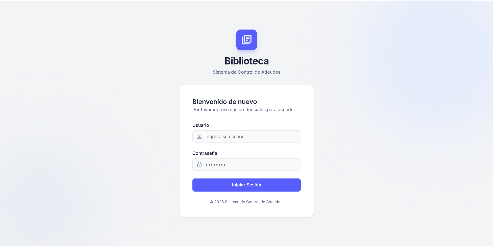
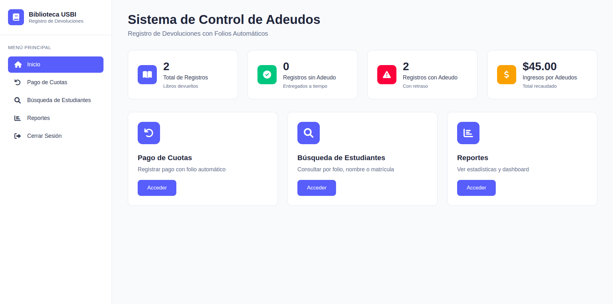
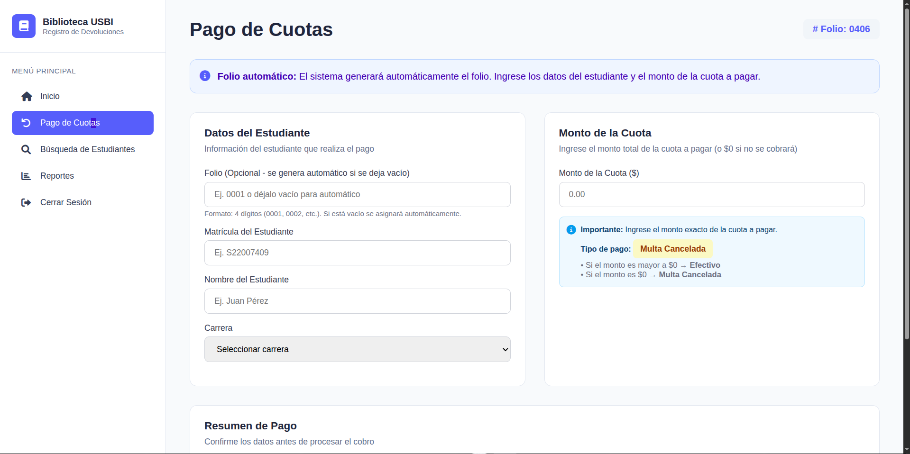
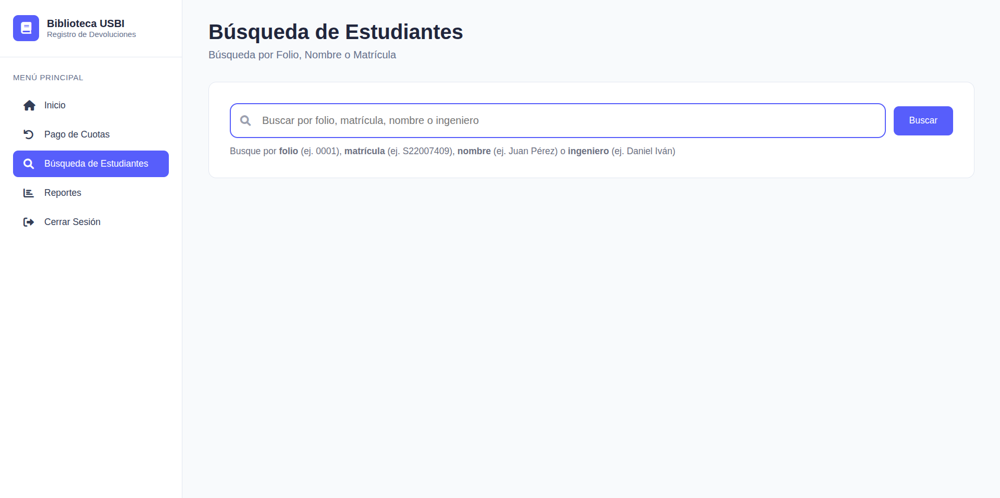
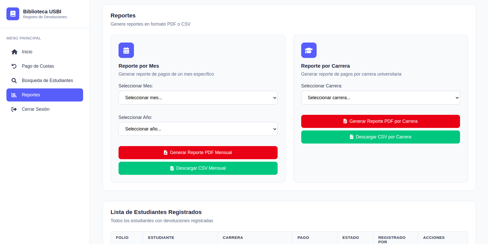

<p align="center">
  
</p>

<h1 align="center">📚 Sistema de Control de Adeudos — Biblioteca USBI</h1>

<p align="center">
  <em>Sistema web para el registro y control de cobros por adeudos de retardo en devolución de libros de la biblioteca universitaria.</em>
</p>

<p align="center">
  
  
  
  
  
  
  
</p>

---

## 📋 Tabla de Contenidos

- [Descripción General](#-descripción-general)
- [Características Principales](#-características-principales)
- [Tecnologías Utilizadas](#️-tecnologías-utilizadas)
- [Arquitectura del Proyecto](#-arquitectura-del-proyecto)
- [Estructura de Archivos](#-estructura-de-archivos)
- [Base de Datos](#️-base-de-datos)
- [API REST — Endpoints](#-api-rest--endpoints)
- [Instalación y Configuración](#-instalación-y-configuración)
- [Uso del Sistema](#-uso-del-sistema)
- [Capturas de Pantalla](#-capturas-de-pantalla)
- [Autores](#-autores)

---

## 🎯 Descripción General

El **Sistema de Control de Adeudos de Biblioteca USBI** es una aplicación web diseñada para gestionar y registrar los cobros por retardo en la devolución de libros de la biblioteca universitaria. Permite al personal de biblioteca llevar un control completo de los pagos realizados por los estudiantes, generar comprobantes en PDF y consultar reportes estadísticos detallados.

### ¿Qué problema resuelve?

Cuando un estudiante devuelve un libro fuera de la fecha límite, se genera un adeudo por retardo. Este sistema automatiza todo el flujo de:

1. **Registro del pago** con folio automático
2. **Consulta de estudiantes** por folio, matrícula o nombre
3. **Generación de comprobantes** en formato PDF
4. **Reportes estadísticos** con gráficas y exportación a CSV/PDF

---

## ✨ Características Principales

| Módulo | Funcionalidad |
|---|---|
| 🏠 **Dashboard** | Panel principal con estadísticas en tiempo real: total de registros, registros con/sin adeudo e ingresos totales recaudados |
| 💰 **Pago de Cuotas** | Formulario de registro de pagos con folio automático o manual, selección de carrera, monto de cuota y resumen previo a confirmar |
| 🔍 **Búsqueda** | Búsqueda flexible por folio, matrícula o nombre del estudiante |
| 📊 **Reportes** | Gráficas interactivas (Chart.js), reportes por mes y por carrera, exportación a PDF y CSV |
| ✏️ **Edición** | Modal para editar registros existentes (folio, matrícula, nombre, carrera, monto) |
| 🗑️ **Eliminación** | Eliminación de registros con modal de confirmación |
| 📄 **Comprobantes PDF** | Generación y previsualización de comprobantes de pago con jsPDF |
| 🔐 **Login** | Pantalla de inicio de sesión con opción de modo oscuro |

---

## 🛠️ Tecnologías Utilizadas

### Frontend
| Tecnología | Uso |
|---|---|
| **HTML5** | Estructura y semántica del sitio |
| **CSS3** | Estilos personalizados, diseño responsivo, animaciones |
| **JavaScript (ES6+)** | Lógica del cliente, manejo del DOM, llamadas a la API |
| **Font Awesome 6** | Iconografía |
| **Chart.js 3.9** | Gráficas interactivas en el módulo de reportes |
| **jsPDF 2.5** | Generación de comprobantes PDF desde el navegador |

### Backend
| Tecnología | Uso |
|---|---|
| **PHP 8.3** | API REST para operaciones CRUD |
| **MySQL 8.0** | Base de datos relacional |
| **Apache** | Servidor web con `.htaccess` para configuración |

---

## 🏗 Arquitectura del Proyecto

El sistema sigue una arquitectura **cliente-servidor** con separación clara de responsabilidades:

```
┌──────────────────────────────────────────────────────────────┐
│                     🖥️  FRONTEND                             │
│  ┌────────────┐  ┌──────────┐  ┌──────────┐  ┌───────────┐   │
│  │ index.html │  │login.html│  │styles.css│  │ script.js │   │
│  │   (SPA)    │  │          │  │login.css │  │           │   │
│  └─────┬──────┘  └──────────┘  └──────────┘  └─────┬─────┘   │
│        │              Navegación SPA               │         │
│        └──────────────── Fetch API ────────────────┘         │
└─────────────────────────────┬────────────────────────────────┘
                              │ HTTP (JSON)
┌─────────────────────────────▼───────────────────────────────┐
│                     ⚙️  BACKEND (PHP)                       │
│  ┌────────────────────────────────────────────────────────┐ │
│  │                    /biblioteca/api/                    │ │
│  │  students.php │ search.php │ stats.php │ reports.php   │ │
│  │  carreras.php │ config.php                             │ │
│  └──────────────────────────┬─────────────────────────────┘ │
│  ┌──────────────────────────▼─────────────────────────────┐ │
│  │   /config/database.php   │   /includes/cors.php        │ │
│  │                          │   /includes/validation.php  │ │
│  └──────────────────────────┬─────────────────────────────┘ │
└─────────────────────────────┬───────────────────────────────┘
                              │ PDO
┌─────────────────────────────▼───────────────────────────────┐
│                   🗄️  BASE DE DATOS (MySQL)                 │
│  Tablas: estudiantes │ carreras │ login                     │
│  Vistas: vista_estadisticas │ vista_adeudos_por_mes         │
│          vista_carreras_adeudos                             │
└─────────────────────────────────────────────────────────────┘
```

---

## 📁 Estructura de Archivos

```
usbi/
│
├── 📄 index.html                # Aplicación principal (SPA)
├── 📄 login.html                # Página de inicio de sesión
├── 🎨 styles.css                # Estilos del sistema principal
├── 🎨 login.css                 # Estilos de la pantalla de login
├── ⚡ script.js                  # Lógica del frontend (1,648 líneas)
├── 🗃️ usbi.sql                  # Dump de la base de datos
├── 📄 info.php                  # Información del servidor PHP
├── 📄 README.md                 # Este archivo
├── 📄 .gitignore                # Archivos ignorados por Git
│
└── 📂 biblioteca/               # Backend del sistema
    ├── 📄 index.php             # Entrada principal del backend
    ├── 📄 .htaccess             # Configuración de Apache
    ├── 📄 dbtest.php            # Script de prueba de conexión a BD
    ├── 📄 debug.php             # Utilidad de depuración
    ├── 📄 phptest.php           # Prueba básica de PHP
    ├── 📄 test_connection.php   # Test de conexión extendido
    │
    ├── 📂 api/                  # Endpoints de la API REST
    │   ├── 📄 students.php      # CRUD de estudiantes
    │   ├── 📄 search.php        # Búsqueda de estudiantes
    │   ├── 📄 stats.php         # Estadísticas generales
    │   ├── 📄 reports.php       # Generación de reportes
    │   ├── 📄 carreras.php      # Listado de carreras
    │   └── 📄 config.php        # Configuración del sistema
    │
    ├── 📂 config/               # Configuración
    │   └── 📄 database.php      # Conexión PDO a MySQL
    │
    └── 📂 includes/             # Utilidades compartidas
        ├── 📄 cors.php          # Manejo de CORS
        └── 📄 validation.php    # Validación de datos
```

---

## 🗄️ Base de Datos

La base de datos `usbi` utiliza **MySQL 8.0** y se compone de las siguientes tablas y vistas:

### Tablas

#### `carreras`
Catálogo de las 52 carreras universitarias de la UV.

| Campo | Tipo | Descripción |
|---|---|---|
| `id` | `INT` (PK, AI) | Identificador único |
| `codigo` | `VARCHAR(10)` | Código abreviado de la carrera |
| `nombre` | `VARCHAR(100)` | Nombre completo de la carrera |
| `facultad` | `VARCHAR(100)` | Facultad a la que pertenece |
| `activa` | `TINYINT(1)` | Estado activo/inactivo |

#### `estudiantes`
Tabla principal que almacena los registros de pagos de adeudos.

| Campo | Tipo | Descripción |
|---|---|---|
| `id` | `INT` (PK, AI) | Identificador único |
| `folio` | `VARCHAR(10)` | Folio único del registro (ej. `No.0001`) |
| `matricula` | `VARCHAR(20)` | Matrícula del estudiante |
| `nombre` | `VARCHAR(100)` | Nombre completo del estudiante |
| `carrera` | `VARCHAR(100)` | Carrera universitaria |
| `adeudo` | `DECIMAL(10,2)` | Monto del adeudo ($) |
| `estado` | `VARCHAR(20)` | `sin_adeudo` o `con_adeudo` |
| `fecha_registro` | `DATETIME` | Fecha y hora del registro |
| `hora_registro` | `TIME` | Hora del registro |
| `id_usuario` | `INT` | Identificador del usuario que registra |
| `id_carrera` | `INT` | Identificador de la carrera |

#### `login`
Tabla que almacena los usuarios con acceso al sistema.

| Campo | Tipo | Descripción |
|---|---|---|
| `id` | `INT` (PK, AI) | Identificador único |
| `usuario` | `VARCHAR(40)` | Nombre de usuario para el login |
| `constrasena` | `VARCHAR(50)` | Contraseña para el login |
| `nombre_completo` | `VARCHAR(100)` | Nombre completo del usuario |

### Vistas SQL

| Vista | Descripción |
|---|---|
| `vista_estadisticas` | Resumen global: total de registros, con/sin adeudo, suma y promedio de adeudos |
| `vista_adeudos_por_mes` | Adeudos agrupados por mes y año |
| `vista_carreras_adeudos` | Adeudos agrupados por carrera con totales y promedios |

---

## 🔌 API REST — Endpoints

La URL base de la API es configurable en `script.js`:

```javascript
const API_BASE_URL = 'http://ubiuv.duckdns.org/biblioteca/api';
```

| Método | Endpoint | Descripción |
|---|---|---|
| `GET` | `/students.php` | Obtener todos los estudiantes registrados |
| `POST` | `/students.php` | Registrar un nuevo pago de adeudo |
| `PUT` | `/students.php?id={id}` | Actualizar un registro existente |
| `DELETE` | `/students.php?id={id}` | Eliminar un registro |
| `GET` | `/search.php?q={término}` | Buscar estudiantes por folio, matrícula o nombre |
| `GET` | `/stats.php` | Obtener estadísticas generales |
| `GET` | `/reports.php` | Obtener datos para reportes |
| `GET` | `/carreras.php` | Listar todas las carreras disponibles |

---

## 🚀 Instalación y Configuración

### Requisitos Previos

- **PHP** >= 8.0
- **MySQL** >= 8.0
- **Apache** con `mod_rewrite` habilitado
- Navegador web moderno (Chrome, Firefox, Edge)

### Pasos de Instalación

**1. Clonar el repositorio**

```bash
git clone https://github.com/Eder-Salas/usbi.git
cd usbi
```

**2. Configurar la base de datos**

```bash
# Crear la base de datos e importar el esquema
mysql -u root -p < usbi.sql
```

**3. Configurar la conexión a la base de datos**

Editar el archivo `biblioteca/config/database.php` con las credenciales de tu servidor:

```php
$host = 'localhost';
$dbname = 'usbi';
$username = 'tu_usuario';
$password = 'tu_contraseña';
```

**4. Configurar la URL de la API**

Editar la constante `API_BASE_URL` en `script.js`:

```javascript
const API_BASE_URL = 'http://tu-servidor/biblioteca/api';
```

**5. Configurar el servidor web**

Asegúrate de que el directorio `biblioteca/` tenga permisos de lectura y que Apache tenga `mod_rewrite` activo.

**6. Acceder al sistema**

Abre tu navegador y navega a:

```
http://tu-servidor/
```

---

## 💡 Uso del Sistema

### 1. Inicio de Sesión
Ingresa tus credenciales en la pantalla de login para acceder al sistema.

### 2. Dashboard (Inicio)
Visualiza las estadísticas principales:
- **Total de registros** de pagos
- **Registros sin adeudo** (multas de $0 o canceladas)
- **Registros con adeudo** (pagos realizados con monto > $0)
- **Ingresos totales** recaudados

### 3. Pago de Cuotas
1. Ingresa la **matrícula** del estudiante
2. Escribe el **nombre** completo
3. Selecciona la **carrera** del catálogo
4. Ingresa el **monto** de la cuota
   - Si el monto es `$0` → Tipo de pago: **Multa Cancelada**
   - Si el monto es `> $0` → Tipo de pago: **Efectivo**
5. Revisa el **resumen** y haz clic en **Registrar Pago**
6. Se genera automáticamente un **folio consecutivo**

### 4. Búsqueda de Estudiantes
Escribe en el campo de búsqueda:
- Un **folio** (ej. `0001`)
- Una **matrícula** (ej. `S22007409`)
- Un **nombre** (ej. `Juan Pérez`)

### 5. Reportes
- Visualiza gráficas de **registros por estado** y **adeudos por mes**
- Genera reportes **PDF** o **CSV** filtrados por mes o por carrera
- Consulta la **tabla completa** de estudiantes registrados con opciones de editar, eliminar y generar comprobante PDF

---

## 📸 Capturas de Pantalla




Pantalla de inicio de sesión para administradores del sistema de control de adeudos de la USBI (UV).

---
### 🏠 Inicio / Dashboard



Vista general del sistema donde se muestran estadísticas clave como total de registros, pagos realizados, adeudos pendientes e ingresos generados. 

---

### 💳 Pago de Cuotas



Formulario para registrar pagos de estudiantes. Incluye generación automática de folio, captura de datos del estudiante y cálculo del tipo de pago (efectivo o multa cancelada).

---

### 🔍 Búsqueda de Estudiantes



Permite buscar estudiantes por folio, matrícula, nombre o ingeniero. Facilita la consulta rápida de información dentro del sistema.

---
### 📊 Reportes



Módulo para generar reportes en formato PDF o CSV por mes o por carrera. Permite exportar información para análisis y control administrativo.

---

## 👤 Autores

- [**Jaqueline González Solís**](https://github.com/Paolad04)
- [**Paola Dexiree González Hernández**](https://github.com/Paolad04)
- [**Ismael Mendez Guzmán**](https://github.com/ismal21)
- [**Eder Gael Salas Torres**](https://github.com/Eder-Salas)
- [**José Aan Sotelo Meseguer**](https://github.com/S22007412)

---

<p align="center">
  Desarrollado con ❤️ para la <strong>Biblioteca USBI</strong> — Universidad Veracruzana
</p>
